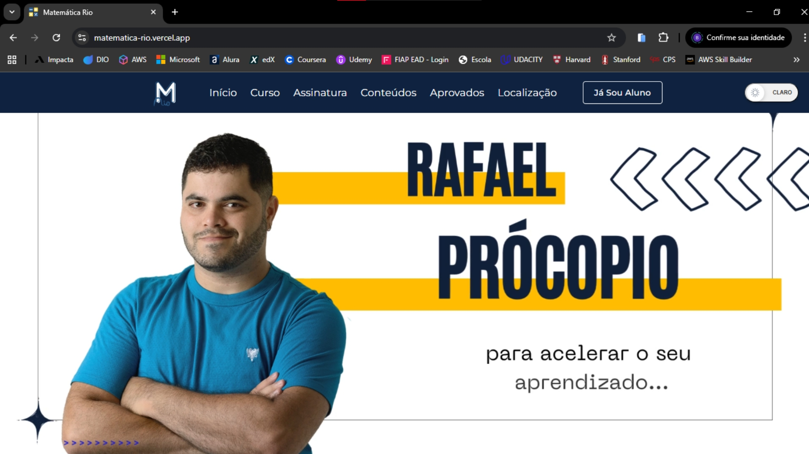
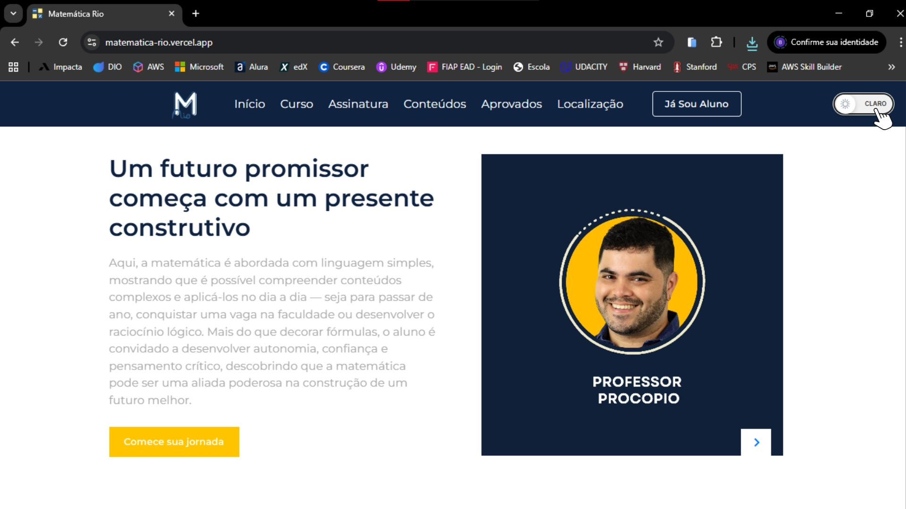
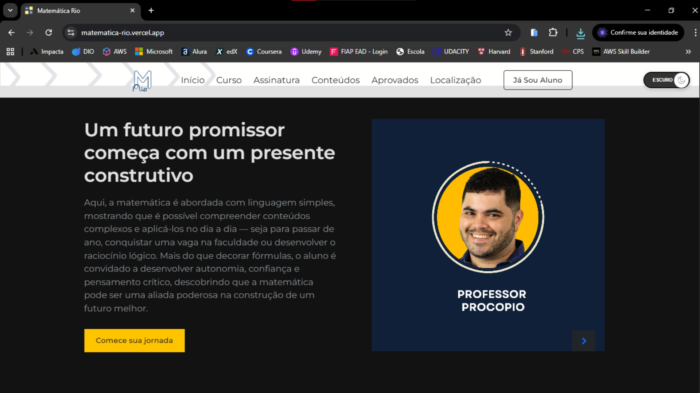
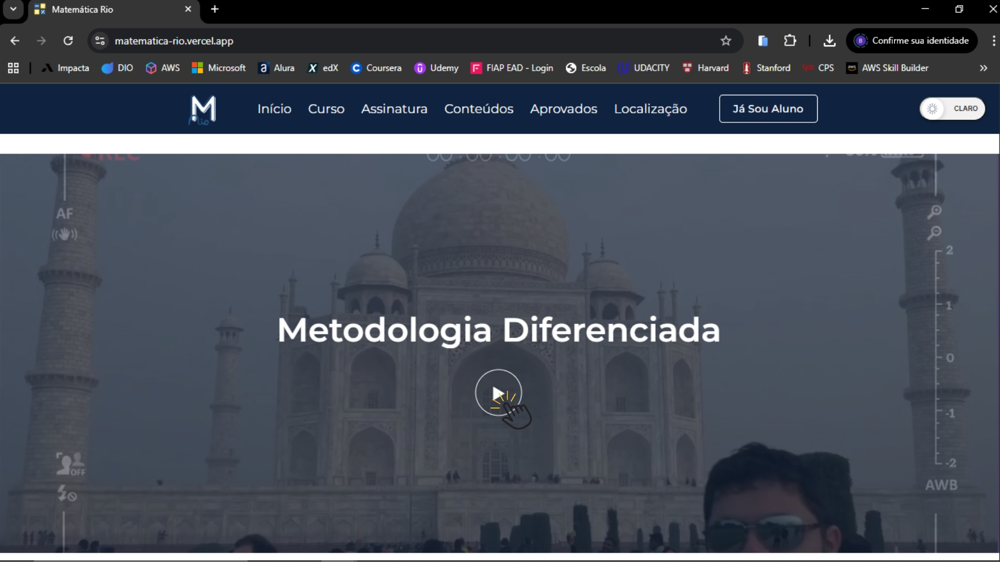
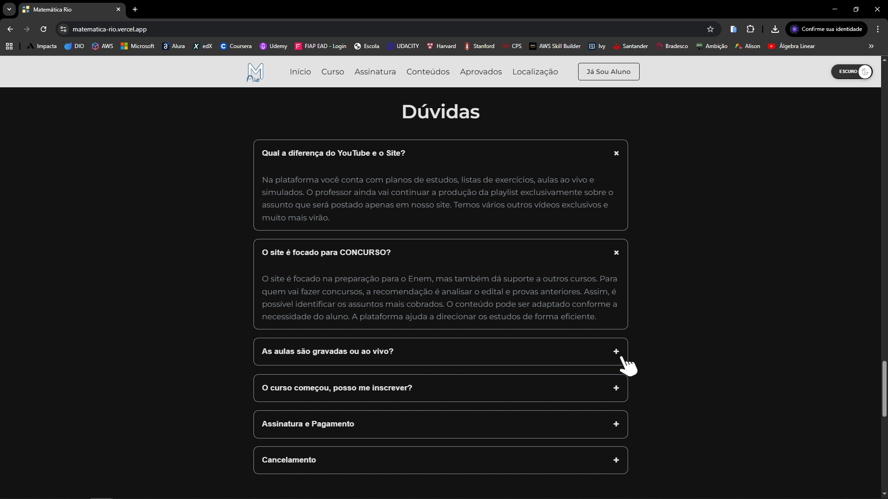

# Plataforma do Professor Procópio 🎓🧮

Este projeto consiste na reformulação completa do front-end da plataforma do Professor Rafael Procópio, o terceiro maior professor de Matemática do Brasil.

Desenvolvido com a colaboração direta do Professor Procópio, o projeto teve caráter voluntário e acadêmico, sendo parte de nossas atividades da faculdade. O objetivo principal foi melhorar a experiência do usuário, otimizar a navegação e modernizar o design da plataforma, mantendo a funcionalidade e a praticidade do sistema original.


---

## 📌 Índice
- [Funcionalidades](#-funcionalidades)
- [Tecnologias Utilizadas](#-tecnologias-utilizadas)
- [Acesso ao Projeto](#-acesso-ao-projeto)
- [Como Rodar o Projeto](#-como-rodar-o-projeto)
- [Como Usar](#-como-usar)
- [Participe da Brincadeira!](#-participe-da-brincadeira)

---

## 📝 Funcionalidades

- Interface moderna e responsiva da página inicial, adaptável a desktop, tablet e mobile.
- Navegação intuitiva e fluida entre seções, facilitando o acesso às informações importantes.
- Elementos interativos (botões, menus, cards) com feedback visual, melhorando a usabilidade.
- Tipografia, cores e ícones escolhidos para facilitar a leitura e tornar a navegação agradável.
- Seções bem espaçadas e scroll suave, proporcionando experiência de leitura e navegação confortável.
- Botão de alternância de tema (modo claro/dark), permitindo ao usuário personalizar a interface conforme sua preferência.

## 💻 Tecnologias Utilizadas

- **HTML5**: Estruturação semântica da página.
- **CSS3**: Estilização moderna e responsiva.
- **JavaScript**: interatividade básica, como animações e elementos dinâmicos.
- **Ferramentas de UX/UI**: conceitos aplicados de experiência do usuário, usabilidade e design visual.

## 🌐 Acesso ao Projeto

[Clique aqui para acessar o projeto no Vercel](https://matematica-rio.vercel.app/) 

[Clique aqui para acessar o projeto github.io](https://bianca-bomfim.github.io/matematica-rio/)

## 💡 Como Rodar o Projeto


### Pré-requisitos

- Ter o [Visual Studio Code (VSCode)](https://code.visualstudio.com/) instalado, caso queira visualizar o código localmente.

### Passos

1. Clone o repositório no terminal:
   ```bash
   git clone https://github.com/bianca-bomfim/matematica-rio
   ``` 

2. Abra o arquivo index.html no Visual Studio Code e use a extensão "Live Server" para rodar o projeto em um navegador.

    [Instalando e Rodando a Extensão](https://marketplace.visualstudio.com/items?itemName=ritwickdey.LiveServer) 
   

## 👥 Como Usar

<br>
1. Video inicial da plataforma . <br><br>


<br><br>


2. Página exibida no tema claro, com opção na barra de navegação para alternar para o tema escuro. <br><br>


<br><br>

3. Visualização da plataforma no modo escuro após a troca de tema. <br><br>


<br><br>


4. Vídeo do Professor Rafael Procopio ensinando matemática na Índia, trazendo credibilidade e conexão internacional.<br><br>


<br><br>


6. Carrossel interativo exibindo os principais conteúdos disponíveis no curso.<br><br>


<br><br>


7. Seção de Dúvidas Frequentes (FAQ) com respostas prontas para facilitar a experiência do usuário.<br><br>


<br><br>


## ✨ Quer ver a plataforma em ação? 

Explore a interface moderna, teste a alternância entre os temas claro e escuro, navegue pelo carrossel de conteúdos e confira como a experiência do usuário foi pensada para ser simples e agradável. Clique, explore e descubra como o design pode transformar a aprendizagem de matemática!
